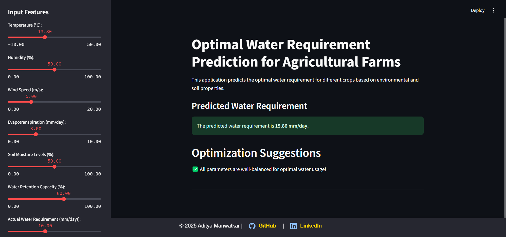

# 🌱 Optimal Water Requirement Prediction for Agricultural Farms  

## 📖 Overview  
This Streamlit-based web application predicts the **optimal water requirement** for different crops based on **environmental conditions and soil properties**. The project uses a **Random Forest Regressor model** trained on agricultural data to provide accurate water recommendations.  

## 🚀 Features  
- 🌡️ **Environmental Inputs**: Temperature, humidity, wind speed, etc.  
- 🌱 **Soil & Crop Data**: Soil type, drainage, crop type, growth stage, etc.  
- 🤖 **Machine Learning Model**: Uses a pre-trained **Random Forest Regressor**.  
- 📊 **Dynamic Predictions**: Get real-time predictions based on user input.  
- 💡 **Optimization Suggestions**: Provides actionable insights for better water usage.  
- 🎨 **Modern UI**: Built with **Streamlit**, featuring a sleek and responsive design.


## 🌍 Live Application  
🔗 **Try it here:** [Optimal Water Requirement Predictor](https://huggingface.co/spaces/adityamanwatkar/optimal_water_usage_prediction) 

## 🛠️ Installation  
### **1️⃣ Clone the Repository**  
```sh
git clone https://github.com/Aditya-Manwatkar/Optimal-Water-Requirement-Prediction-for-Agricultural-Farms.git
cd Optimal-Water-Requirement-Prediction-for-Agricultural-Farms
```

### **2️⃣ Install Dependencies**  
Make sure you have **Python 3.8+** installed. Then, install the required packages:  
```sh
pip install -r requirements.txt
```

### **3️⃣ Run the Application**  
```sh
streamlit run app.py
```

## 📂 Project Structure  
```
📁 your-repo/
│── app.py                  # Streamlit application
│── main.py                 # Model training script
│── random_forest_regressor_model.pkl  # Trained ML model
│── clean_water_requirement_data.csv   # Dataset
│── requirements.txt        # Dependencies
│── README.md               # Project documentation           
│── EDA and modelling.ipynb # EDA and Modeling Notebook           
```

## 🎯 How It Works  
1. Users **input environmental and soil parameters** via the sidebar.  
2. The app **encodes categorical features** and **normalizes numerical data**.  
3. The **Random Forest Regressor** predicts the **optimal water requirement**.  
4. The app provides **insights & optimization tips** based on user input.  

## 📸 Screenshots  


## 📌 Technologies Used  
- **Python** 🐍  
- **Streamlit** 🎨  
- **Scikit-Learn** 🤖  
- **Pandas, NumPy** 📊  
- **Joblib** (for model persistence)  

## ✨ Author  
👤 **LinkedIN**:[Aditya Manwatkar](https://www.linkedin.com/in/aditya-manwatkar/)
🔗 **GitHub**: [Aditya-Manwatkar](https://github.com/Aditya-Manwatkar)  

## 📜 License  
This project is **open-source** and available under the **MIT License**.  

---

### ✅ Ready to contribute or improve this project? Feel free to fork and star ⭐ this repository! 🚀  
